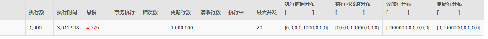
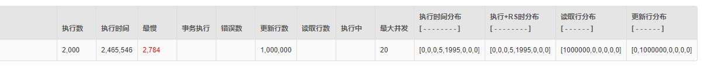

学习笔记
1. SpringBoot自带HikarCP+JdbcTemplate批量一次性插入方式
NamedParameterJdbcTemplate 批量方式
       耗时：5796908毫秒

2. Druid+JdbcTemplate批量一次性插入方式

3. Druid+JdbcTemplate批量+线程池方式
一次任务跑1000，
耗时： 152607毫秒

一次任务跑500

